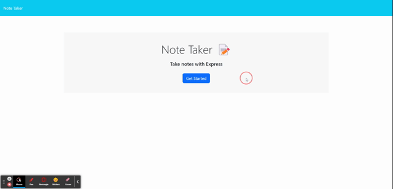

# Simple-Note-Taker 
  

  ## Description

  This application is made to help an individual keep track of their daily tasks.  This is intended to be simple, quick, and organized to help with day to day integration of the app.

  ## Table of Contents

  *[Usage](#usage)

  *[License](#license)

  *[Contributions](#contributions)

  *[Credits](#credits)

  *[Questions](#questions)
  
  ## Usage

  To use this application it is fairly easy.  Simply navigate to the link provided in the repo and at the end of this section.  Once there please click the "Get Started" button.  This will take you to the notes page itself. From there you can click on "Note Title" and enter your text, and do the same for "Note Text".  Then click "Save Note" in the top right of the screen and your note will be saved.  You can delete the note using the little red trash icon next to the note title. You can also clear the whole form using the clear form button in the top right of the screen when typing a note. Refer to the video for a visual usage demonstration.

  
  

  Video Link: https://drive.google.com/file/d/1UBcpDahKPMsoECpsNV6yVwWGEDM_NxqB/view

  App link: https://gstroup11-simple-note-taker-c3f68a401065.herokuapp.com/
  
  ## License

  This project is licensed under the MIT license.

  ## Contributions

  Contributors please refer to the installation section.

  ## Credits

  A majority of this project was built with the help of XpertLearning Assistant. 

  ## Questions

  If you have any questions regarding this project, you can contact me directly at gstroup11@gmail.com.

  You can see more of my work at [gstroup11](https://github.com/gstroup11/).
